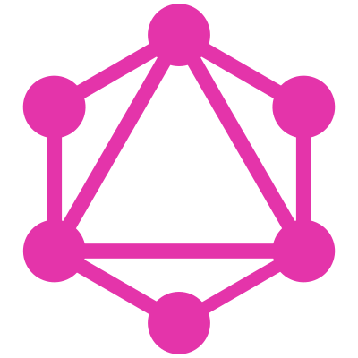

<!-- AUTOGENERATED PAGE, DO NOT EDIT IT DIRECTLY -->
# Security team

This group is for receiving security vulnerability disclosures, and coordination on remediation. Anyone may send mail to this group, although if you are not already a member of a GraphQL Foundation mailing list your message will be held for moderation. Please be patient, and a moderator will release your message to the group.

[About](https://foundation.graphql.org) | [Mailing list](mailto:security@lists.foundation.graphql.org) | [Calendar](https://calendar.graphql.org) | [Chat](https://discord.graphql.org) | [Twitter](https://twitter.com/graphql) | [Artwork](https://graphql.org/brand)
## Governance:

[Code of Conduct](https://code-of-conduct.graphql.org)
## Repositories:

* [https://github.com/graphql/foundation](https://github.com/graphql/foundation)

## Members:

### **Lee Byron**

* **Executive Director, GraphQL**

[GitHub](https://github.com/leebyron) | [Twitter](https://twitter.com/leeb) | [LinkedIn](https://linkedin/in/lee-byron-a5097a163)

### **Rikki Schulte**

[GitHub](https://github.com/acao) | [Twitter](https://twitter.com/rikki_js) | [LinkedIn](https://linkedin/in/rikkischulte)

### **Ivan Goncharov**

[GitHub](https://github.com/IvanGoncharov) | [Twitter](https://twitter.com/E1Goncharov) | [LinkedIn](https://linkedin/in/igoncharov)

### **Orta Therox**

[GitHub](https://github.com/orta) | [Twitter](https://twitter.com/orta) | [LinkedIn](https://linkedin/in/ortatherox)

------

This directory is automatically generated. To make changes, please submit a pull request against [groups/security.yml](/groups/security.yml)